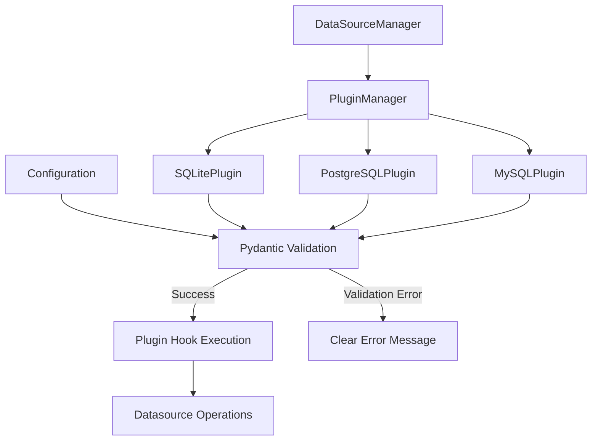
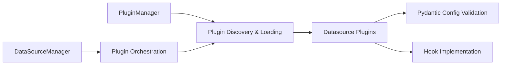

# Datasource Manager Implementation - Current Plugin Architecture

## Current Implementation Analysis

The current implementation uses a sophisticated pluggy-based plugin system that provides better separation of concerns and extensibility than the simplified approach.

### Current Architecture



### Component Responsibilities



## Current Implementation Benefits

1. **Plugin Architecture**: Uses pluggy for dynamic plugin discovery and loading
2. **Type Safety**: Pydantic models provide robust configuration validation
3. **Extensibility**: New datasources can be added as plugins without core changes
4. **Separation of Concerns**: Each plugin is self-contained with its own configuration
5. **Hook System**: Standardized interface through pluggy hook specifications
6. **Runtime Discovery**: Plugins are discovered and loaded at runtime
7. **Better Error Handling**: Clear validation errors through Pydantic

## Current File Structure

```
src/components/datasources/
├── __init__.py
├── base_datasource.py (HOOK SPECIFICATIONS)
├── plugins/
│   ├── __init__.py
│   ├── sqlite_plugin.py
│   ├── postgresql_plugin.py
│   └── mysql_plugin.py
└── manager.py (PLUGIN-BASED)
```

## Current Implementation Details

### Hook Specifications (base_datasource.py)

```python
from pluggy import HookspecMarker

hookspec = HookspecMarker("datasource")

class BaseDatasource(ABC):
    """Abstract base class with hook specifications"""
    
    @hookspec
    def connect(self, config) -> Any:
        """Open a datasource connection."""
        pass
    
    @hookspec
    def read(self, conn, query: QuerySpec) -> pd.DataFrame:
        """Read data from datasource."""
        pass
    
    @hookspec
    def insert(self, conn, data: InsertSpec) -> int:
        """Insert data into datasource."""
        pass
    
    @hookspec
    def update(self, conn, spec: UpdateSpec) -> int:
        """Update data in datasource."""
        pass
    
    @hookspec
    def delete(self, conn, spec: DeleteSpec) -> int:
        """Delete data from datasource."""
        pass
```

### Plugin Implementation (plugins/sqlite_plugin.py)

```python
from pluggy import HookimplMarker
from ..base_datasource import SQLiteConfig, QuerySpec, BaseDatasource

hookimpl = HookimplMarker("datasource")

class SQLiteDataSource(BaseDatasource):
    name = "sqlite"

    @classmethod
    def get_config_class(cls):
        return SQLiteConfig

    @hookimpl
    def connect(self, config: SQLiteConfig):
        conn = sqlite3.connect(config.path)
        conn.row_factory = sqlite3.Row
        return conn

    @hookimpl
    def read(self, conn, query: QuerySpec):
        # Implementation with proper error handling
        table = getattr(conn, '_current_table', 'data')
        # ... query building logic
        return pd.DataFrame(rows, columns=columns)
```

### Pydantic Configuration Models

```python
class SQLiteConfig(BaseModel):
    path: str = Field(..., description="Path to SQLite database file")
    table_name: str = Field(..., description="Name of the table to operate on")

class PostgreSQLConfig(BaseModel):
    user: str = Field(..., description="Database username")
    password: str = Field(..., description="Database password")
    host: str = Field(default="localhost", description="Database host")
    port: int = Field(default=5432, description="Database port")
    database: str = Field(..., description="Database name")
    table_name: str = Field(..., description="Name of the table to operate on")
```

## Plugin Manager Implementation

```python
class DataSourceManager:
    """Plugin-based manager that uses pluggy for datasource discovery"""
    
    def __init__(self):
        self.pm = pluggy.PluginManager("datasource")
        self.pm.add_hookspecs(BaseDatasource)
        self.load_plugins()
    
    def load_plugins(self):
        """Load all available datasource plugins"""
        from .plugins import SQLiteDataSource, PostgreSQLDataSource, MySQLDataSource
        
        self.pm.register(SQLiteDataSource())
        self.pm.register(PostgreSQLDataSource())
        self.pm.register(MySQLDataSource())
    
    def get_datasource_for_config(self, table_config: Dict[str, Any]) -> BaseDatasource:
        """Find appropriate datasource plugin for configuration"""
        # Try each plugin to see which can handle the config
        for plugin in self.pm.get_plugins():
            if hasattr(plugin, 'get_config_class'):
                try:
                    config_class = plugin.get_config_class()
                    config_class(**table_config)
                    return plugin
                except ValidationError:
                    continue
        
        raise ValueError(f"No datasource found for configuration: {table_config}")
    
    def get_table_data(self, table_config: Dict[str, Any], limit: int = 100) -> tuple:
        """Get table data using appropriate datasource plugin"""
        datasource = self.get_datasource_for_config(table_config)
        
        # Validate configuration
        config_class = datasource.get_config_class()
        config = config_class(**table_config)
        
        # Execute operation through plugin hooks
        conn = datasource.connect(config)
        df = datasource.read(conn, QuerySpec(limit=limit, offset=0))
        
        # Convert to tuple format for backward compatibility
        if df.empty:
            return [], []
        else:
            columns = df.columns.tolist()
            rows = [tuple(row) for row in df.values]
            return columns, rows
```

## Benefits of Current Plugin Architecture

1. **Dynamic Discovery**: Plugins are discovered and loaded at runtime
2. **Type Safety**: Pydantic provides robust configuration validation
3. **Extensibility**: New datasources can be added as plugins without core changes
4. **Standardized Interface**: Hook specifications ensure consistent plugin interface
5. **Better Error Handling**: Clear validation errors through Pydantic models
6. **Separation of Concerns**: Each plugin is self-contained
7. **Testability**: Each plugin can be tested independently
8. **Maintainability**: Clear separation between core and plugin code

## Migration Strategy

1. **Hook Specifications**: Define clear hook specifications in base_datasource.py
2. **Plugin Implementation**: Each datasource implements the required hooks
3. **Configuration Models**: Use Pydantic for robust configuration validation
4. **Plugin Manager**: Use pluggy for dynamic plugin management
5. **Backward Compatibility**: Maintain legacy method interfaces where needed

## Implementation Timeline

1. **Day 1**: Define hook specifications and base interfaces
2. **Day 2**: Implement SQLite plugin with Pydantic configuration
3. **Day 3**: Implement PostgreSQL and MySQL plugins
4. **Day 4**: Create plugin manager and test integration

This plugin-based approach provides superior extensibility, type safety, and maintainability compared to the simplified approach, making it the preferred implementation strategy. 